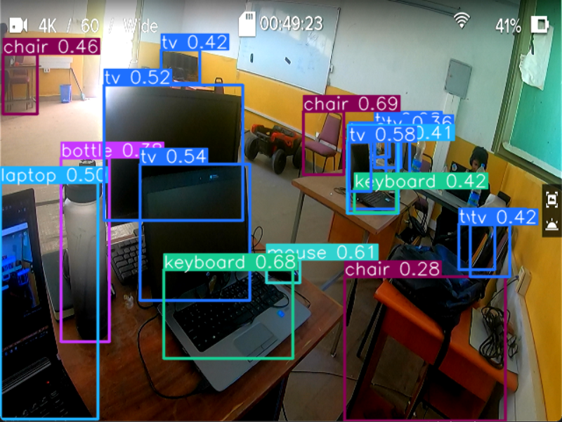
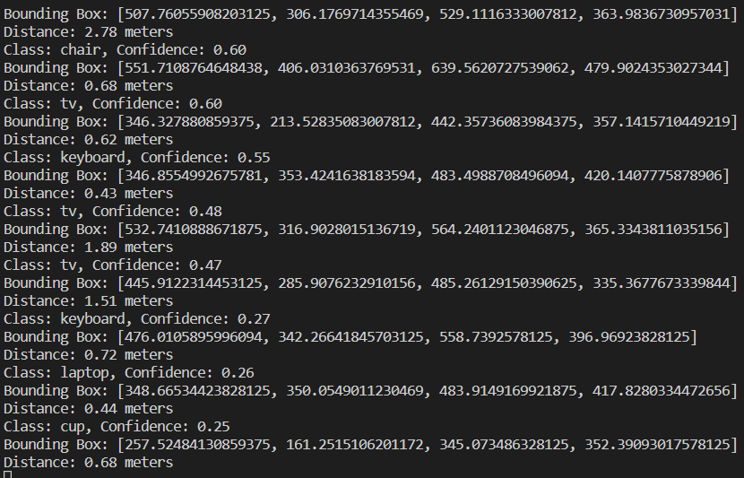

# Object Detection and Depth Estimation 🔎📏

This repository contains code for performing object detection and depth estimation using Python, PyTorch, and YOLOv5. The code uses a pre-trained YOLOv5 model to detect objects in a live video stream from a camera and estimates the distance to the detected objects using stereo vision.

## Prerequisites 🧑‍💻

To use this code, you'll need to have the following software installed:

- Anaconda: https://www.anaconda.com/products/individual 🐍
- PyCharm or VS Code: https://www.jetbrains.com/pycharm/download/ or https://code.visualstudio.com/download 💻

## Installation 🚀

To get started, follow these steps:

1. Install Anaconda by downloading and running the installer for your operating system from the Anaconda website.

2. Open PyCharm or VS Code and create a new project in a directory of your choice.

3. Open a terminal window within PyCharm or VS Code and create a new conda environment by running the following command:

`conda create --name detection_env`

4. Activate the new conda environment by running the following command:

`conda activate detection_env`


5. Install PyTorch with GPU support by running the following command:

`conda install pytorch torchvision torchaudio pytorch-cuda=11.8 -c pytorch -c nvidia`

N.B: To check weather torch is using your GPU or not, you can use the following code.

```
import torch

# Check if CUDA is available
if torch.cuda.is_available():
    # Get the current CUDA device index and its name
    current_device = torch.cuda.current_device()
    device_name = torch.cuda.get_device_name(current_device)
    print(f"CUDA is available. Using GPU: {device_name} (device {current_device})")
else:
    print("CUDA is not available. Using CPU.")
```

This command installs PyTorch version 2.0 with CUDA 11.8 support.

6. Clone the YOLOv5 repository and install the remaining dependencies by running the following commands:

```
git clone https://github.com/ultralytics/yolov5.git
cd yolov5
pip install -r requirements.txt
```

The first command clones the YOLOv5 repository, and the second and third commands install the remaining dependencies.

7. You're now ready to run the code! To run the script, execute the following command:

`python depth-estimation.py`


The script will open a window showing the live video stream from the camera with the detected objects and estimated distances overlaid on the video.

To exit the script, press the 'q' key.

## Example Output 📷

Here are some example output images from the script:

- Object detection:  🕵️‍♀️
- Depth estimation:  📏

## Credits 🙏

This code is based on the YOLOv5 object detection tutorial by Ultralytics: https://github.com/ultralytics/yolov5

## Contributing 🛠️

Contributions to this project are welcome! If you find a bug or would like to add a new feature, please open an issue or submit a pull request.

## License 📃

This project is licensed under the MIT License. You may use, distribute, and modify this code as long as you include the original copyright notice and license terms. See LICENSE.txt for details.


